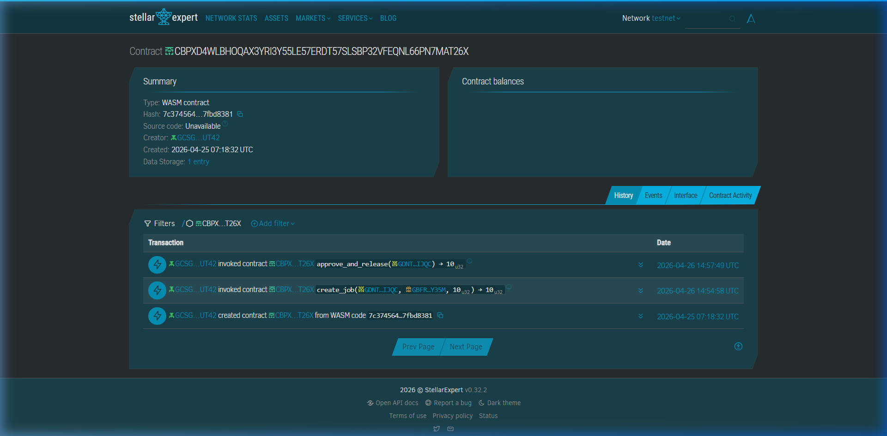

# QuickPay Counter

A trustless, on-chain job payment system built on Stellar using Soroban smart contracts.

---

## What Is QuickPay Counter?

QuickPay Counter is a **non-custodial, blockchain-based job payment system** that enables clients and freelancers to execute secure, transparent payments on the Stellar network. Using a Soroban smart contract, all job records and payment approvals are stored immutably on-chain with zero intermediaries.

**Current Version:** Proof of concept supporting a single active job per contract instance.

---

## Problem

Freelancers and clients face real friction with traditional payment workflows:

- **Lack of transparency:** Payment status is opaque; freelancers have no way to independently verify whether a payment was initiated, held, or completed.
- **High fees:** Third-party processors (PayPal, Wise, bank wires) take 3–5% or charge flat fees of $5–$25 per transaction, eating into freelancer earnings.
- **Trust issues:** Both parties must trust a centralized intermediary to hold and route funds correctly.
- **Settlement delays:** International payments can take 3–5 business days to clear.
- **No immutable record:** Payment history lives in private databases that can be altered, lost, or disputed without resolution.

## Solution

QuickPay Counter moves the entire payment lifecycle on-chain using **Stellar's Soroban smart contracts**:

- ✅ Clients create jobs specifying the freelancer address and payment amount
- ✅ All job records are stored immutably in the contract's on-chain state
- ✅ Only the client who created the job can approve and release the payment
- ✅ The contract enforces the agreement automatically — zero intermediaries
- ✅ Every payment event is publicly verifiable on the Stellar blockchain
- ✅ Settlement is near-instant (~5 seconds) with fees under $0.01

---

## How It Works

### 1. Job Creation
A client calls `create_job` on the smart contract, specifying:
- The freelancer's Stellar address
- The agreed payment amount
- The job record is stored in contract state with status **Pending (0)**

### 2. Work Completion
The freelancer completes the work off-chain. Both parties can query the contract at any time to verify job details (client, freelancer, amount, status).

### 3. Approval & Payment Release
Once the client is satisfied with the work, they call `approve_and_release`, which:
- Verifies the caller is the original client
- Checks the job hasn't already been released
- Updates the job status to **Released (1)**
- Increments the running total of all released payments
- Returns the released amount as confirmation

### 4. On-Chain Verification
Anyone can query the contract to verify:
- **Job status** — pending (0) or released (1)
- **Job details** — client address, freelancer address, payment amount
- **Total released** — cumulative amount of all approved payments

All records are **immutable and permanent** on the Stellar blockchain.

---

## Demo Flow (CLI)

```
1. Create Job        → Client submits job with freelancer address and amount
2. Complete Work     → Freelancer completes the work off-chain
3. Approve & Release → Client calls approve_and_release to finalize payment
4. Verify On-Chain   → Anyone can query job status and payment totals
```

---

## Architecture

```
Stellar Testnet
└── QuickPay Counter Soroban Contract
    ├── Job Management   (create_job)
    ├── Payment Release  (approve_and_release)
    └── Status Queries   (get_status, get_total, get_job)
```

**No frontend. No backend server.** All job data, payment status, and approval logic live immutably on-chain via the Soroban smart contract.

---

## Project Structure

```
quickpay_counter/
├── contracts/
│   ├── freelance_escrow/       # Main smart contract
│   │   ├── src/
│   │   │   ├── lib.rs          # Soroban smart contract (job + payment logic)
│   │   │   └── test.rs         # 3 unit tests (create, release, status)
│   │   ├── Cargo.toml
│   │   └── Makefile            # Build & test shortcuts
│   └── hello-world/            # Soroban starter template (scaffolding)
│       ├── src/
│       │   ├── lib.rs
│       │   └── test.rs
│       ├── Cargo.toml
│       └── Makefile
├── images/
│   └── deployed-contract.png   # Screenshot of deployed contract
├── Cargo.toml                  # Workspace configuration
└── README.md
```

---

## Stellar Features Used

| Feature | Usage |
|---|---|
| Soroban smart contracts | Job creation, payment approval, status tracking |
| Instance storage | Persistent on-chain state for job records and payment totals |
| Address type | Stellar-native identity for client and freelancer |
| Caller authorization | Only the original client can approve and release payment |

---

## Smart Contract

Deployed on **Stellar Testnet**:

```
CBPXD4WLBHOQAX3YRI3Y55LE57ERDT57SLSBP32VFEQNL66PN7MAT26X
```

**View on Stellar Expert:**
https://stellar.expert/explorer/testnet/contract/CBPXD4WLBHOQAX3YRI3Y55LE57ERDT57SLSBP32VFEQNL66PN7MAT26X

**View on Stellar Lab:**
https://lab.stellar.org/smart-contracts/contract-explorer?$=network$id=testnet&label=Testnet&contractId=CBPXD4WLBHOQAX3YRI3Y55LE57ERDT57SLSBP32VFEQNL66PN7MAT26X

### Deployed Contract Screenshot



### Contract Functions

| Function | Caller | Description |
|---|---|---|
| `create_job(client, freelancer, amount)` | Client | Creates a new job record on-chain |
| `approve_and_release(caller)` | Client | Approves work and marks payment as released |
| `get_status()` | Anyone | Read-only — returns job status (0 = pending, 1 = released) |
| `get_total()` | Anyone | Read-only — returns total amount released across all jobs |
| `get_job()` | Anyone | Read-only — returns job details (client, freelancer, amount) |

### Job Lifecycle

```
Pending (status = 0) ──── client calls approve_and_release ────→ Released (status = 1)
```

---

## Prerequisites

- **Rust** (latest stable)
- **Soroban CLI** v25+
- A Stellar **Testnet** account funded via [Friendbot](https://developers.stellar.org/docs/build/guides/testnet#use-testnet-with-soroban)

---

## Build & Testing

### 1. Build the Contract

Navigate to the contract directory:

```bash
cd contracts/freelance_escrow
```

#### Using Makefile (Recommended)

Build and run tests:
```bash
make all      # Build and run tests
make build    # Build only
make test     # Test only
make fmt      # Format code
make clean    # Clean build artifacts
```

#### Using Cargo Directly

Build the WASM target:
```bash
stellar contract build
```

Run unit tests:
```bash
cargo test
```

### 2. Unit Tests

The contract includes **3 comprehensive unit tests** in `src/test.rs`:

| Test | Purpose |
|---|---|
| `test_create_job` | Verifies job creation stores correct amount (100 units) |
| `test_release_payment` | Verifies client can release payment and amount is returned |
| `test_status_update` | Verifies job status transitions from pending (0) to released (1) |

Run tests with:
```bash
cd contracts/freelance_escrow
make test
# or
cargo test
```

Expected output:
```
running 3 tests
test test_create_job ... ok
test test_release_payment ... ok
test test_status_update ... ok

test result: ok. 3 passed; 0 failed; 0 ignored
```

---

## Deployment to Testnet

### 1. Generate a Persistent Identity

```bash
stellar keys generate --global deployer --network testnet
```

### 2. Fund Your Account

Visit [Friendbot](https://developers.stellar.org/docs/build/guides/testnet#use-testnet-with-soroban) to fund your account with test XLM.

### 3. Deploy the Contract

```bash
cd contracts/freelance_escrow

stellar contract deploy \
  --wasm target/wasm32-unknown-unknown/release/freelance_escrow.wasm \
  --source deployer \
  --network testnet
```

**Output:** The command returns your **Contract ID** (a string starting with `C`). Save this — you'll use it for all CLI invocations.

**Example Contract ID:**
```
CBPXD4WLBHOQAX3YRI3Y55LE57ERDT57SLSBP32VFEQNL66PN7MAT26X
```

---

## CLI Usage Examples

Replace `CBPXD4WLBHOQAX3YRI3Y55LE57ERDT57SLSBP32VFEQNL66PN7MAT26X` with your deployed **Contract ID**.

Replace `<CLIENT_ADDRESS>` and `<FREELANCER_ADDRESS>` with actual Stellar addresses.

### 1. Create a Job

Client submits a job with amount for freelancer:

```bash
stellar contract invoke \
  --id CBPXD4WLBHOQAX3YRI3Y55LE57ERDT57SLSBP32VFEQNL66PN7MAT26X \
  --source client \
  --network testnet \
  -- create_job \
  --client <CLIENT_ADDRESS> \
  --freelancer <FREELANCER_ADDRESS> \
  --amount 100
```

**Response:** `100` (the job amount is created and stored)

### 2. Approve Work and Release Payment

Client approves the completed work and releases payment:

```bash
stellar contract invoke \
  --id CBPXD4WLBHOQAX3YRI3Y55LE57ERDT57SLSBP32VFEQNL66PN7MAT26X \
  --source client \
  --network testnet \
  -- approve_and_release \
  --caller <CLIENT_ADDRESS>
```

**Response:** `100` (the amount released)

**Note:** Only the original client can call this function. Non-clients will receive: `"Only client can approve payment"`

### 3. Check Payment Status

Query the current job status (0 = pending, 1 = released):

```bash
stellar contract invoke \
  --id CBPXD4WLBHOQAX3YRI3Y55LE57ERDT57SLSBP32VFEQNL66PN7MAT26X \
  --source client \
  --network testnet \
  -- get_status
```

**Response Examples:**
- `0` — Job is pending (not yet approved)
- `1` — Job has been released

### 4. View Total Released Amount

Query total amount released across all jobs on this contract:

```bash
stellar contract invoke \
  --id CBPXD4WLBHOQAX3YRI3Y55LE57ERDT57SLSBP32VFEQNL66PN7MAT26X \
  --source client \
  --network testnet \
  -- get_total
```

**Response:** Total units released (e.g., `100` if one job for 100 units was released)

### 5. View Job Details

Query job details (client, freelancer, amount):

```bash
stellar contract invoke \
  --id CBPXD4WLBHOQAX3YRI3Y55LE57ERDT57SLSBP32VFEQNL66PN7MAT26X \
  --source client \
  --network testnet \
  -- get_job
```

**Response:** A tuple containing:
```
(CLIENT_ADDRESS, FREELANCER_ADDRESS, 100)
```

---

## Important Limitations (Proof of Concept)

⚠️ **This is a single-job proof of concept.** The current implementation has the following limitations:

1. **Single Active Job:** Only one job can exist per contract instance at a time. Creating a new job will overwrite the previous job.
   - **Workaround:** Deploy separate contract instances for each job, or upgrade to use indexed storage (maps) for production.

2. **No Multiple Concurrent Jobs:** The contract uses simple instance storage, not maps. This design choice prioritizes simplicity for this POC.
   - **Future Enhancement:** Implement a job mapping structure with unique job IDs for production use.

3. **No Payment Transfers:** The contract approves payments but does not transfer funds. For production, integrate with Stellar's native asset system or stablecoins (USDC).

---

## Target Users

Freelancers and clients who need a simple, trustless way to manage job payments on-chain — with transparent approval workflows and cryptographic proof of every payment event.

This POC is ideal for:
- Learning Soroban smart contract development
- Prototyping payment workflows on Stellar
- Demonstrating immutable job records and approval logic

---

## Why Stellar

- ✅ **Sub-cent fees** — ~0.00001 XLM per operation
- ✅ **Fast finality** — 3–5 second transaction confirmation
- ✅ **Native smart contracts** — Soroban provides a modern, Rust-based contract runtime
- ✅ **Built-in compliance** — anchors, KYC-ready infrastructure
- ✅ **Stablecoin support** — native USDC for real-world payment scenarios

Stellar's speed and cost make it ideal for lightweight, transparent payment applications where immutability and verifiability matter.

---

## Project Repository

https://github.com/reymarkjpanes/quickpay_counter

**Language Composition:** 92% Rust, 8% Makefile
